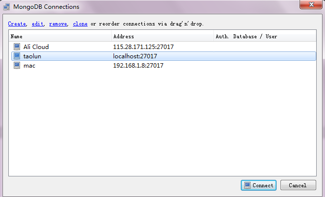
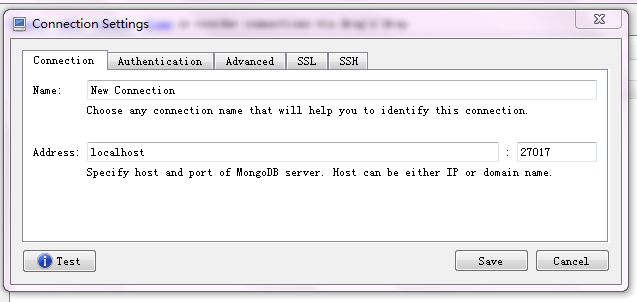
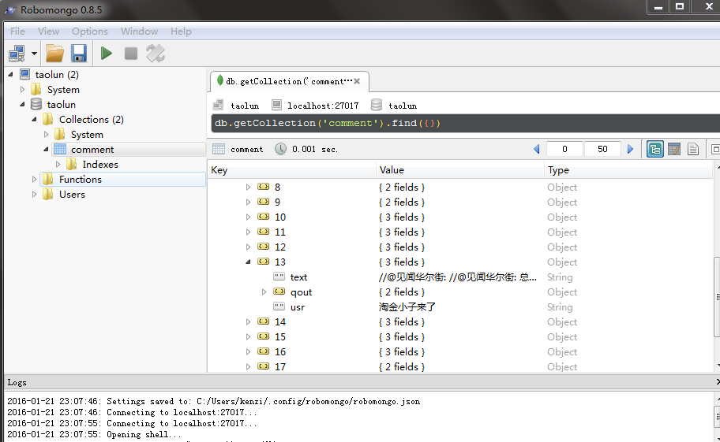

# 用monggodb存储雪球讨论内容

* 安装mongodb
[mongodb下载地址](https://www.mongodb.org/downloads#production)

* 安装pymongo
```
pip install pymongo
```

* 安装requests库
```
pip install requests
```

* 安装monggodb gui 客户端
[下载地址](http://app.robomongo.org/download.html)

* 将你的mongodb安装路径添加到全局变量
例如：
```
PATH = "E:\Program Files\MongoDB\Server\3.0\bin"
```
* 在命令行中开启mongodb服务端
```
mongod
```
* 运行taolun.py(mongod命令行不要关闭，服务端要保持开启，客户端才能连接上服务端)

```
python taolun.py
```

* 运行robomongo查看存入的数据(mongod命令行不要关闭，服务端要保持开启，客户端才能连接上服务端)



点击creat



Name任意输入，端口为27017默认端口,不要更改。
点击Save

回到


点击connect



双击comment会出现讨论数据

引用放在quot里，usr是讨论者的名字，text是讨论的内容。
